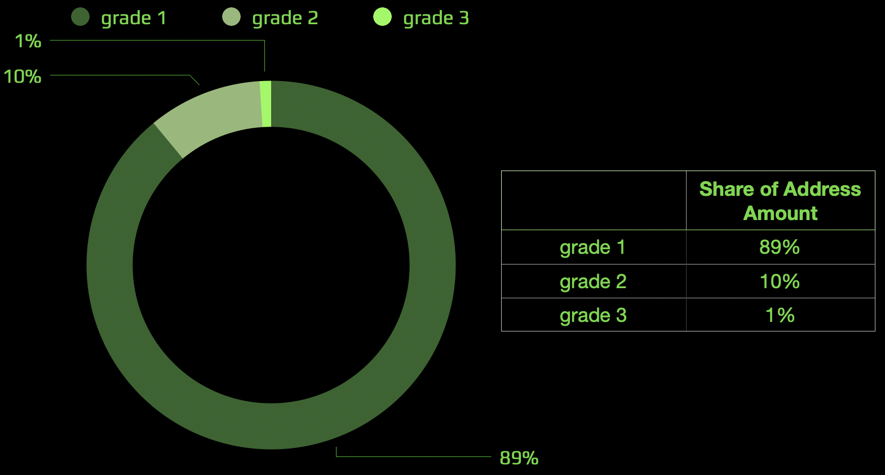

# cyberGift

@groovybear, @mastercyb

The purpose of the research is to inspire at least 100k power-users of web3 to join the force of learning Superintelligence. To achieve this, we are going to gift 70% of the Bostrom genesis tokens BOOT to agents of Ethereum and Cosmos who are capable to contribute their best to the quality of the knowledge graph. First, we started by highlighting key audiences for establishing network effects and tackling basic chicken and eggs. After we balance out the participation of key actors by splitting them into grades and adjusting allocations within the groups. Then we apply a filter in order to remove toxic fiat brains from the collective thought process. And finally, we add a crucial incentive to hurry up.

The research results are represented by reproducible scripts which output addresses and balances which will be loaded to the claim CosmWasm contract after the launch of Bostrom.

Data source is [BigQuery crypto-ethereum dataset](https://console.cloud.google.com/bigquery?d=crypto_ethereum&p=bigquery-public-data&page=dataset&project=cosmic-keep-223223) 
by [Blockchain ETL](https://github.com/blockchain-etl).

Research is done on the [proposal](https://cyber.page/governance/20) basis. We hope this research can help pioneer the new wave of thinking in decentralized marketing.

## Connecting the Dots

The biggest problem in bootstrapping a blockchain ecosystem from scratch is that it is not enough to attract just users. There exist established network effects between four key groups:

Hence we have to understand how to attract all these guys simultaneously if we targeting healthy organic growth. 

But in our case, that would not be enough. First, Cyber is a content-oriented project. So we need to understand how to add content creators to the soup. Second, information on the project has to be propagated somehow to all these guys, so key opinion leaders have to be incentivized. Third, as the Cyber project heavily relies on the interchain idea we have to attract the community behind IBC technology. Also, we want to add some fun giving the power to the guys behind weird cyberpunk ideas. And finally, we want to check the credibility of the most trusted liquidity hubs.

## Distribution between Grades

An amount of distributed BOOT tokens should be equal for each grade within an audience.  
Also amount of addresses should be divided into grades for each audience as  

## Average Citizens
- ETH owners and senders of outgoing transactions

## Heroes of the Great Web
- participants of Genesis and ETH 2.0 stackers

## Extraordinary Hackers
 - contract creators

## Passionate Investors
- owners of the selected ERC20 tokens

## Masters of the Great Web
- ERC721 owners and creators of contracts using factories

## Key Opinion Leaders**
- TOP holders by the selected ERC20 tokens

## Cyberpunks
- owners of the cyberpunk tokens

## Astronauts
- ATOM owners

## CEXes
- manual assigned addresses** - top CEXes

These audiences were highlighted because their participants are necessary to form a full-fledged ecosystem of the project.

## Audience Rules

The initial conditions for the allocation of classes were selected based on the analysis of web3 user activity and the need to cover the most web3 power-users.  
All distribution rules between grades are calculated in the respective jupyter notebooks. 

<table style="text-align: left">
    <thead style="text-align: center">
        <tr>
            <th rowspan=2>Audience</th>
            <th rowspan=2>Rule</th>
            <th colspan=3>Grade</th>
            <th rowspan=2>Calculations (Jupyter notebooks)</th>
        </tr>
        <tr>
            <th>1</th>
            <th>2</th>
            <th>3</th>
        </tr>
    </thead>
    <tbody>
        <tr>
            <td style="text-align: left"> Astronauts </td>
            <td style="text-align: left"> ATOM Balance </td>
            <td style="text-align: center"> > 0.1 ATOM </td>
            <td style="text-align: center"> > 215 ATOM </td>
            <td style="text-align: center"> > 8,633 ATOM </td>
            <td style="text-align: center"> <a href="atom__astronauts.ipynb">ATOM Analysis</a> </td>
        </tr>
        <tr>
            <td rowspan=2 style="text-align: left"> Average Citizens </td>
            <td style="text-align: left"> ETH balance > 0.01 ETH and Amount of outgoing tx</td>
            <td style="text-align: center"> > 3 tx </td>
            <td style="text-align: center"> > 60 tx </td>
            <td style="text-align: center"> > 657 tx </td>
            <td rowspan=2 style="text-align: center"> <a href="eth_and_tx__citizens.ipynb">ETH Analysis</a> </td>
        </tr>
        <tr>
            <td style="text-align: left"> ETH balance</td>
            <td style="text-align: center"> > 1 ETH</td>
            <td style="text-align: center"> > 32 ETH</td>
            <td style="text-align: center"> > 551 ETH</td>
        </tr>
        <tr>
            <td rowspan=3 style="text-align: left"> Cyberpunks </td>
            <td style="text-align: left"> Owners of the Selected ERC20 tokens </td>
            <td style="text-align: center"> - </td>
            <td style="text-align: center"> - </td>
            <td style="text-align: center"> FOAM or GOLD </td>
            <td style="text-align: center"> <a href="erc20__investors_and_cyberpunks.ipynb">ERC20 Analysis</a> </td>
        </tr>
        <tr>
            <td style="text-align: left"> Owners of the Selected ERC721 tokens </td>
            <td style="text-align: center"> - </td>
            <td style="text-align: center"> - </td>
            <td style="text-align: center"> Unicorns, DRAGON or Cryptopunks </td>
            <td style="text-align: center"> <a href="erc721__masters_and_cyberpunks.ipynb">ERC721 Analysis</a> </td>
        </tr>
        <tr>
            <td style="text-align: left"> Urbit Owners </td>
            <td style="text-align: center"> - </td>
            <td style="text-align: center"> - </td>
            <td style="text-align: center"> here </td>
            <td style="text-align: center"> <a href="urbit__cyberpunks.ipynb">Urbit Analysis</a> </td>
        </tr>
        <tr>
            <td rowspan=2 style="text-align: left"> Extraordinary Hackers </td>
            <td> Fee spending to created contracts1 by contract creators2 </td>
            <td style="text-align: center"> > 0 ETH </td>
            <td style="text-align: center"> > 4 ETH </td>
            <td style="text-align: center"> > 233 ETH </td>
            <td rowspan=2 style="text-align: center"> <a href="gas__hackers_and_masters.ipynb">Gas Analysis</a> </td>
        </tr>
        <tr>
            <td style="text-align: left"> Fee spending to created contracts1 by factory creators3 </td>
            <td style="text-align: center"> - </td>
            <td style="text-align: center"> > 0 ETH </td>
            <td style="text-align: center"> > 10 ETH </td>
        </tr>
        <tr>
            <td style="text-align: left"> Key Opinion Leaders </td>
            <td style="text-align: left"> Top 100 ERC20 Holders by Tokens </td>
            <td style="text-align: center"> - </td>
            <td style="text-align: center"> - </td>
            <td style="text-align: center"> only here </td>
            <td style="text-align: center"> <a href="erc20__leaders.ipynb">Top 100 ERC20 Holders</a> </td>
        </tr>
        <tr>
            <td style="text-align: left"> Manual Assigned Addresses </td>
            <td style="text-align: left"> - </td>
            <td style="text-align: center"> - </td>
            <td style="text-align: center"> - </td>
            <td style="text-align: center"> only here </td>
            <td style="text-align: center"> <a href="manual_assigned_addresses__cexes.ipynb">Assigning Addresses</a> </td>
        </tr>
        <tr>
            <td rowspan=3 style="text-align: left"> Masters of the Great Web </td>
            <td style="text-align: left"> Amount of ERC721 tokens </td>
            <td style="text-align: center"> > 0 NFT </td>
            <td style="text-align: center"> > 6 NFT </td>
            <td style="text-align: center"> > 159 NFT </td>
            <td rowspan=2 style="text-align: center"> <a href="erc721__masters_and_cyberpunks.ipynb">ERC721 Analysis</a> </td>
        </tr>
        <tr>
            <td style="text-align: left"> Owners of the Selected ERC721 tokens </td>
            <td style="text-align: center"> - </td>
            <td style="text-align: center"> ENS </td>
            <td style="text-align: center" style="text-align: center"> Gitcoin Kudos or LAND </td>
        </tr>
        <tr>
            <td style="text-align: left"> Fee spending to contracts4, by contract creators, ETH </td>
            <td style="text-align: center"> > 0 ETH </td>
            <td style="text-align: center"> > 0.005 ETH </td>
            <td style="text-align: center"> > 0.755 ETH </td>
            <td style="text-align: center"> <a href="gas__hackers_and_masters.ipynb">Gas Analysis</a> </td>
        </tr>
        <tr>
            <td style="text-align: left"> Passionate Investors </td>
            <td style="text-align: left"> Number of tokens >= 2 and ERC20 balance </td>
            <td style="text-align: center"> > 0.01 ETH </td>
            <td style="text-align: center"> > 6 ETH </td>
            <td style="text-align: center"> > 96 ETH </td>
            <td style="text-align: center"> <a href="erc20__investors_and_cyberpunks.ipynb">ERC20 Analysis</a> </td>
        </tr>
        <tr>
            <td rowspan=2 style="text-align: left"> True Heroes of the Great Web </td>
            <td style="text-align: left"> Genesis </td>
            <td style="text-align: center"> - </td>
            <td style="text-align: center"> - </td>
            <td style="text-align: center"> only here </td>
            <td rowspan=2 style="text-align: center"> <a href="genesis_and_eth2__heroes.ipynb">Genesis and ETH2 Stakers</a> </td>
        </tr>
        <tr>
            <td style="text-align: left"> ETH 2.0 Stakers </td>
            <td style="text-align: center"> - </td>
            <td style="text-align: center"> - </td>
            <td style="text-align: center"> only here </td>
        </tr>
        <tr>
            <td colspan=5 style="text-align: left"> Final Distribution </td>
            <td style="text-align: center"> <a href="final_distribution.ipynb">Final Distribution</a></td>
        </tr>
    </tbody>
</table>
<i>
1  excluding fee from a contract creator address 
2  excluding contracts created by factories 
3  excluding factories that only created contracts when called from the creator of that factory 
4 including contracts created by factories only 
</i>

## Distribution between Audiences

Based on counting the number of addresses and determining the fair reward of the participants of each audience, 
the following balanced distribution between them is proposed:  

When an address hits multiple audiences, its reward is cumulative.

## Excluding Fiat Brains 

Addresses based on the fiat system will not be included, 
namely those that satisfy these two conditions:
1. Stablecoin balance is more than sum of ETH and [selected ERC20 tokens](erc20__investors_and_cyberpunks.ipynb) balances
2. Stablecoin balance is more than 0.1 ETH 

## Prize to be the First 
We've added the incentive to claim gift early.  
There are about **6M** addresses in Gift, but at the same time we expect that only the first **~1/10** accounts can claim them.  
There will be incentive **20x** for those who claim first reducing to **5x** who came last.  
This incentive does not apply to the **Manual Set Addresses** audience.  

## Data Pipeline

## Gift Execution

## Final Distribution   

[Final Distribution Table](https://console.cloud.google.com/bigquery?project=cosmic-keep-223223&p=cosmic-keep-223223&d=final&t=final_distribution&page=table&ws=!1m5!1m4!4m3!1scosmic-keep-223223!2sfinal!3sfinal_distribution)  
**Check your address in the [Dashboard](https://datastudio.google.com/u/0/reporting/53e1c28b-9f10-497c-9b5b-9f2a4749450b)**
