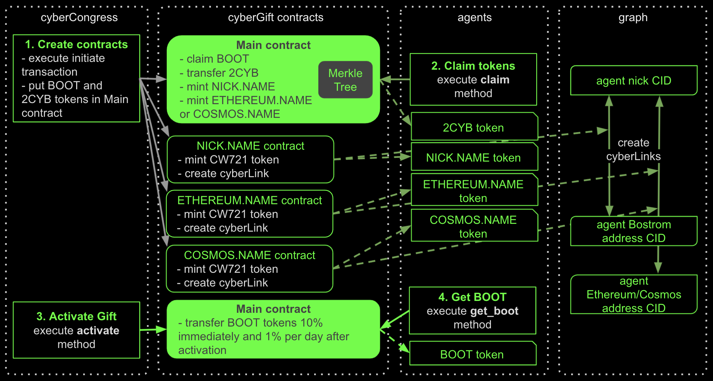

# cyberGift

@groovybear, @mastercyb

The purpose of this research is to inspire at least 100k power-users of web3 to join the force of learning 
Superintelligence. To achieve this, we are going to gift 70% of the Bostrom genesis tokens BOOT to agents of Ethereum 
and Cosmos who are capable to contribute their best to the quality of the knowledge graph. First, we started 
by highlighting key audiences for establishing network effects and tackling basic chicken and eggs. Next, we balance 
out the participation of key actors by splitting them into grades and adjusting allocations within the groups. 
Then we apply a filter in order to remove toxic fiat brains from the collective thought process. Finally, we add 
a crucial incentive to hurry up.

The research results are represented by reproducible scripts which output addresses and balances which will be loaded 
to the claim CosmWasm contract after the launch of Bostrom.

Data source is [BigQuery crypto-ethereum dataset](https://console.cloud.google.com/bigquery?d=crypto_ethereum&p=bigquery-public-data&page=dataset&project=cosmic-keep-223223) 
by [Blockchain ETL](https://github.com/blockchain-etl).

Research is done on the [proposal](https://cyber.page/governance/20) basis. We hope this research can help pioneer 
a new wave of thinking in decentralized marketing.

## Connecting the Dots

The biggest problem in bootstrapping a blockchain ecosystem from scratch is that it is not enough to attract just users. 
Established network effects exist between four key groups:

Hence we have to understand how to attract all these guys simultaneously in order to target healthy organic growth. 

In our case that would not be enough. First, Cyber is a content-oriented project. We need to understand how 
to add content creators to the soup. Second, information on the project has to be propagated somehow to all these guys, 
so key opinion leaders have to be incentivized. Third, as the Cyber project heavily relies on the interchain idea we 
have to attract the community behind IBC technology. We also want to add some fun giving the power to the guys behind 
weird cyberpunk ideas. Finally, we want to check the credibility of the most trusted liquidity hubs.

## Distribution between Grades

An amount of distributed BOOT tokens should be equal for each grade within an audience.  
The amount of addresses should also be divided into grades for each audience as  

## Average Citizens
- ETH owners and senders of outgoing transactions

## Masters of the Great Web
- ERC721 owners and creators of contracts using factories

## Astronauts
- ATOM owners
- OSMO owners and liquidity providers
- LUNA owners

## Extraordinary Hackers
 - contract creators

## Heroes of the Great Web
- participants of Genesis and ETH 2.0 stackers

## Passionate Investors
- owners of the selected ERC20 tokens

## Key Opinion Leaders
- TOP holders by the selected ERC20 tokens

## Cyberpunks
- owners of the cyberpunk tokens

## Leeches
- manual assigned addresses of top CEXes

These audiences were highlighted because their participation is necessary to form a full-fledged ecosystem of the project.

## Audience Rules

The initial conditions for the allocation of classes were selected based on the analysis of web3 user activity and the 
need to cover the most web3 power-users.  
All distribution rules between grades are calculated in the respective jupyter notebooks. 

<table style="text-align: left">
    <thead style="text-align: center">
        <tr>
            <th rowspan=2>Audience</th>
            <th rowspan=2>Rule</th>
            <th colspan=3>Grade</th>
            <th rowspan=2>Calculations (Jupyter notebooks)</th>
        </tr>
        <tr>
            <th>1</th>
            <th>2</th>
            <th>3</th>
        </tr>
    </thead>
    <tbody>
        <tr>
            <td rowspan=2 style="text-align: left"> Average Citizens </td>
            <td style="text-align: left"> ETH balance > 0.12 ETH and Amount of outgoing tx</td>
            <td style="text-align: center"> > 4 tx </td>
            <td style="text-align: center"> > 125 tx </td>
            <td style="text-align: center"> > 1,531 tx </td>
            <td rowspan=2 style="text-align: center"> <a href="eth_and_tx__citizens.ipynb">ETH Analysis</a> </td>
        </tr>
        <tr>
            <td style="text-align: left"> ETH balance</td>
            <td style="text-align: center"> > 1 ETH</td>
            <td style="text-align: center"> > 29 ETH</td>
            <td style="text-align: center"> > 485 ETH</td>
        </tr>
        <tr>
            <td rowspan=3 style="text-align: left"> Masters of the Great Web </td>
            <td style="text-align: left"> Amount of ERC721 tokens </td>
            <td style="text-align: center"> > 0 NFT </td>
            <td style="text-align: center"> > 12 NFT </td>
            <td style="text-align: center"> > 160 NFT </td>
            <td rowspan=2 style="text-align: center"> <a href="erc721__masters_and_cyberpunks.ipynb">ERC721 Analysis</a> </td>
        </tr>
        <tr>
            <td style="text-align: left"> Owners of the Selected ERC721 tokens </td>
            <td style="text-align: center"> - </td>
            <td style="text-align: center"> ENS </td>
            <td style="text-align: center" style="text-align: center"> Gitcoin Kudos or LAND </td>
        </tr>
        <tr>
            <td style="text-align: left"> Fee spending to contracts4, by contract creators, ETH </td>
            <td style="text-align: center"> > 0 ETH </td>
            <td style="text-align: center"> > 0.004 ETH </td>
            <td style="text-align: center"> > 0.477 ETH </td>
            <td style="text-align: center"> <a href="gas__hackers_and_masters.ipynb">Gas Analysis</a> </td>
        </tr>
        <tr>
            <td rowspan=3 style="text-align: left"> Astronauts </td>
            <td style="text-align: left"> ATOM Balance </td>
            <td style="text-align: center"> > 1 ATOM </td>
            <td style="text-align: center"> > 180 ATOM </td>
            <td style="text-align: center"> > 4,352 ATOM </td>
            <td rowspan=3 style="text-align: center"> <a href="atom_osmo_luna__astronauts.ipynb">ATOM, OSMO and LUNA Analysis</a> </td>
        </tr>
        <tr>
            <td style="text-align: left"> OSMO Balance </td>
            <td style="text-align: center"> > 1 OSMO </td>
            <td style="text-align: center"> > 752 OSMO </td>
            <td style="text-align: center"> > 24,352 OSMO </td>
        </tr>
        <tr>
            <td style="text-align: left"> LUNA Balance </td>
            <td style="text-align: center"> > 1 LUNA </td>
            <td style="text-align: center"> > 568 LUNA </td>
            <td style="text-align: center"> > 12,364 LUNA </td>
        </tr>
        <tr>
            <td rowspan=2 style="text-align: left"> Extraordinary Hackers </td>
            <td> Fee spending to created contracts1 by contract creators2 </td>
            <td style="text-align: center"> > 0 ETH </td>
            <td style="text-align: center"> > 4 ETH </td>
            <td style="text-align: center"> > 254 ETH </td>
            <td rowspan=2 style="text-align: center"> <a href="gas__hackers_and_masters.ipynb">Gas Analysis</a> </td>
        </tr>
        <tr>
            <td style="text-align: left"> Fee spending to created contracts1 by factory creators3 </td>
            <td style="text-align: center"> - </td>
            <td style="text-align: center"> > 0 ETH </td>
            <td style="text-align: center"> > 10 ETH </td>
        </tr>
        <tr>
            <td rowspan=2 style="text-align: left"> Heroes of the Great Web </td>
            <td style="text-align: left"> Genesis </td>
            <td style="text-align: center"> - </td>
            <td style="text-align: center"> - </td>
            <td style="text-align: center"> only here </td>
            <td rowspan=2 style="text-align: center"> <a href="genesis_and_eth2__heroes.ipynb">Genesis and ETH2 Stakers</a> </td>
        </tr>
        <tr>
            <td style="text-align: left"> ETH 2.0 Stakers </td>
            <td style="text-align: center"> - </td>
            <td style="text-align: center"> - </td>
            <td style="text-align: center"> only here </td>
        </tr>
        <tr>
            <td style="text-align: left"> Passionate Investors </td>
            <td style="text-align: left"> Number of selected ERC20 tokens >= 2 and balance of it </td>
            <td style="text-align: center"> > 0.01 ETH </td>
            <td style="text-align: center"> > 3 ETH </td>
            <td style="text-align: center"> > 55 ETH </td>
            <td style="text-align: center"> <a href="erc20__investors_and_cyberpunks.ipynb">ERC20 Analysis</a> </td>
        </tr>
        <tr>
            <td style="text-align: left"> Key Opinion Leaders </td>
            <td style="text-align: left"> Top 100 Holders by selected ERC20 Tokens </td>
            <td style="text-align: center"> - </td>
            <td style="text-align: center"> - </td>
            <td style="text-align: center"> only here </td>
            <td style="text-align: center"> <a href="erc20__leaders.ipynb">Top ERC20 Holders</a> </td>
        </tr>
        <tr>
            <td rowspan=3 style="text-align: left"> Cyberpunks </td>
            <td style="text-align: left"> Owners of the Selected ERC20 tokens </td>
            <td style="text-align: center"> - </td>
            <td style="text-align: center"> - </td>
            <td style="text-align: center"> FOAM or GOLD </td>
            <td style="text-align: center"> <a href="erc20__investors_and_cyberpunks.ipynb">ERC20 Analysis</a> </td>
        </tr>
        <tr>
            <td style="text-align: left"> Owners of the Selected ERC721 tokens </td>
            <td style="text-align: center"> - </td>
            <td style="text-align: center"> - </td>
            <td style="text-align: center"> Unicorns, DRAGON or Cryptopunks </td>
            <td style="text-align: center"> <a href="erc721__masters_and_cyberpunks.ipynb">ERC721 Analysis</a> </td>
        </tr>
        <tr>
            <td style="text-align: left"> Urbit Owners </td>
            <td style="text-align: center"> - </td>
            <td style="text-align: center"> - </td>
            <td style="text-align: center"> here </td>
            <td style="text-align: center"> <a href="urbit__cyberpunks.ipynb">Urbit Analysis</a> </td>
        </tr>
        <tr>
            <td style="text-align: left"> Leeches </td>
            <td style="text-align: left"> 10 CEXes addresses </td>
            <td style="text-align: center"> - </td>
            <td style="text-align: center"> - </td>
            <td style="text-align: center"> only here </td>
            <td style="text-align: center"> <a href="manual_assigned_addresses__cexes.ipynb">Assigning Addresses</a> </td>
        </tr>
        <tr>
            <td colspan=5 style="text-align: left"> Final Distribution </td>
            <td style="text-align: center"> <a href="final_distribution.ipynb">Final Distribution</a></td>
        </tr>
    </tbody>
</table>
<i>
1  excluding fee from a contract creator address 
2  excluding contracts created by factories 
3  excluding factories that only created contracts when called from the creator of that factory 
4 including contracts created by factories only 
</i>

## Distribution between Audiences

Based on counting the number of addresses and determining the fair reward of the participants of each audience, 
the following balanced distribution between them is proposed:  

When an address hits multiple audiences, its reward is cumulative.

## Excluding Fiat Brains 

Addresses based on the fiat system will not be included, 
namely those that satisfy these two conditions:
1. Stablecoin balance is more than sum of ETH and [selected ERC20 tokens](erc20__investors_and_cyberpunks.ipynb) balances
2. Stablecoin balance is more than 0.1 ETH 

## Prize to be the First 
We've added an incentive to claim gift early.  
There are about **4M** addresses in Gift, but at the same time we expect that only the first **~1/10** accounts can 
claim them.  

There will be incentive **13x** for those who claim first reducing to **7x** who came last.

## Data Pipeline

## Gift Execution

## Final Distribution   

[Final Distribution Table](https://console.cloud.google.com/bigquery?project=cosmic-keep-223223&p=cosmic-keep-223223&d=final&t=final_distribution&page=table&ws=!1m5!1m4!4m3!1scosmic-keep-223223!2sfinal!3sfinal_distribution)  
**Check your address in the [Dashboard](https://datastudio.google.com/u/0/reporting/53e1c28b-9f10-497c-9b5b-9f2a4749450b)**

# Result Validation
My name is Maxim Razhev (@ninjascant). I'm a software engineer with 3+ years of experience in blockchain analytics development. I made a manual re-check of queries used here e.g.
- re-calculating balances on a subset of wallets and comparing with a node output
- comparing the list of NFTs and other entities with open sources like Etherscan and OpenSea
- verifying that the data presented in the final tables are consistent with query logic

So, by making this commit, I confirm that the results of the analysis presented in this repository are checked by me and correct.
